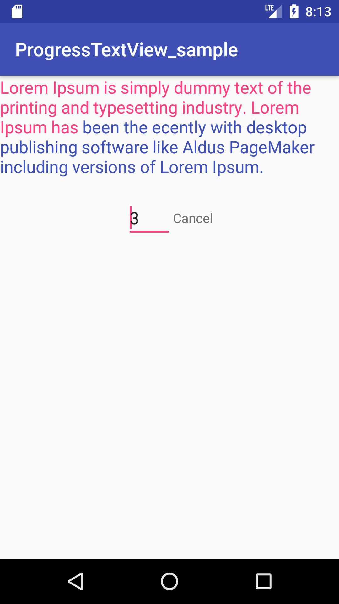

Android-Progress-TextView
=====
Helper library for Android developers.

This is "ProgressTextView".

Sample Capture
=====



Download
--------
use Gradle:

```gradle
 repositories {
  jcenter()
}

dependencies {
  compile 'net.jaedong:progresstextview:1.0.0'
}
```

Or Maven:

```xml
<dependency>
  <groupId>net.jaedong</groupId>
  <artifactId>progresstextview</artifactId>
  <version>1.0.0</version>
  <type>pom</type>
</dependency>
```


How do I use?
-------------------
You can see more detail from [MainActivity.java][1].

Simple use cases will look something like this:
* XML

```xml
    <net.jaedong.progresstextview.ProgressTextView
        android:id="@+id/text"
        android:layout_width="wrap_content"
        android:layout_height="wrap_content"
        android:text="@string/jd_str"
        android:textColor="@color/colorPrimary"
        android:textSize="18dp"
        jaedong:highlightTextColor="@color/colorAccent" />

```

* JAVA

```java
public class MainActivity extends AppCompatActivity {

    private TextView startButton;
    private ProgressTextView progressTextView;
    private EditText secEditText;
    private ProgressTextView.SpannableTask target = null;

    @Override
    protected void onCreate(Bundle savedInstanceState) {
        super.onCreate(savedInstanceState);
        setContentView(R.layout.activity_main);


        progressTextView = (ProgressTextView) findViewById(R.id.text);
        progressTextView.addProgressListener(new ProgressListener() {
            @Override
            public void complete() {
                Toast.makeText(MainActivity.this, "Complete", Toast.LENGTH_SHORT).show();
                cancelProgress();
            }
        });

        secEditText = (EditText) findViewById(R.id.sec);
        startButton = (TextView) findViewById(R.id.emptyButton);
        startButton.setTag(0);
        startButton.setOnClickListener(new View.OnClickListener() {
            @Override
            public void onClick(View view) {
                int type = (int) view.getTag();
                if (type == 0) {
                    startProgress();
                } else {
                    cancelProgress();
                }
            }
        });
    }

    private void cancelProgress() {
        // cancel all
        target.cancel();

        startButton.setText("Start");
        startButton.setTag(0);
    }

    private void startProgress() {
        target = progressTextView.getSpannableTask();
        // target.runTask(1.3f);
        // target.runTask(5000);
        target.runTask(Integer.parseInt(secEditText.getText().toString()) * 1000);

        startButton.setText("Cancel");
        startButton.setTag(1);
    }
}
```


Updated
------
```
v 1.0.0 - First version.
```

Author
------
Jaedong Kim - @JackDinealKIM on GitHub,
mashiaro@gmail.com

License
-------
```code
Copyright 2017 JD Kim

Licensed under the Apache License, Version 2.0 (the "License");
you may not use this file except in compliance with the License.
You may obtain a copy of the License at

http://www.apache.org/licenses/LICENSE-2.0

Unless required by applicable law or agreed to in writing, software
distributed under the License is distributed on an "AS IS" BASIS,
WITHOUT WARRANTIES OR CONDITIONS OF ANY KIND, either express or implied.
See the License for the specific language governing permissions and
limitations under the License.
```

[1]: https://github.com/JackDinealKIM/ProgressTextView/blob/master/app/src/main/java/net/jaedong/progresstextview_sample/MainActivity.java


